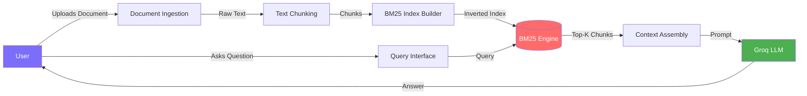
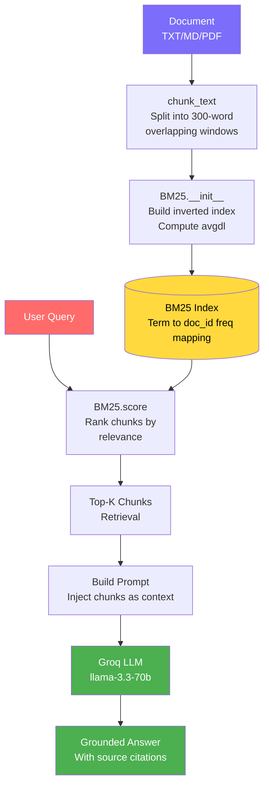
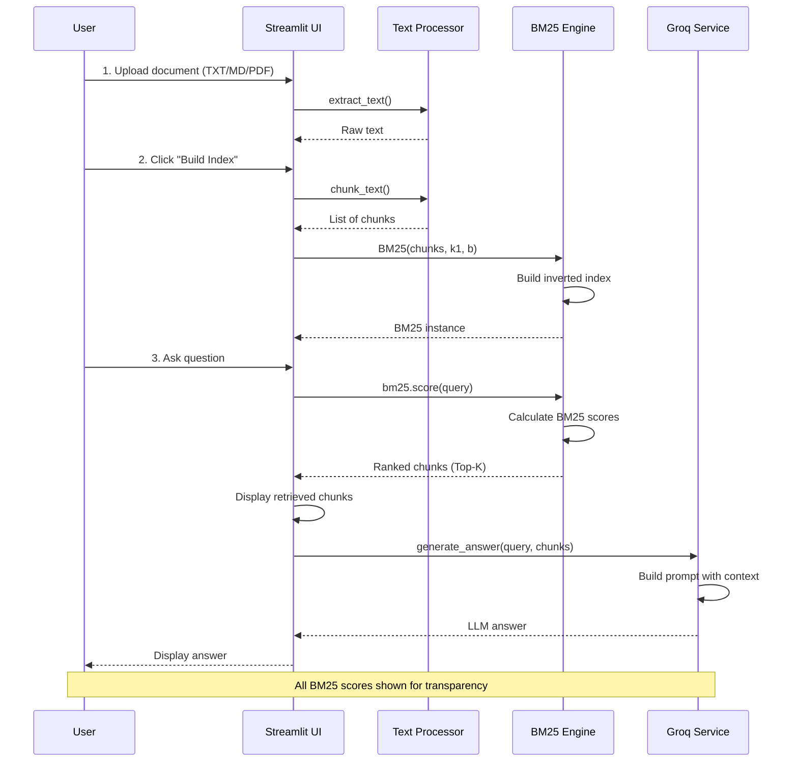
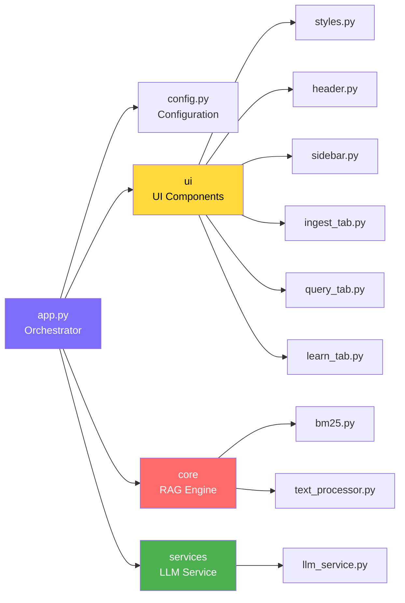

# Vectorless RAG

A professional Retrieval-Augmented Generation (RAG) application using **BM25** for document retrieval — no embeddings, no vector databases.

## Features

- ✅ **Pure BM25 Retrieval** — Classical information retrieval algorithm
- ✅ **No Embeddings Required** — No GPU or embedding API calls
- ✅ **No Vector Database** — Zero infrastructure overhead
- ✅ **Groq LLM Integration** — Fast, grounded answers via LLM
- ✅ **Deterministic & Explainable** — Transparent scoring
- ✅ **Document Support** — TXT, MD, PDF files
- ✅ **Interactive UI** — Streamlit-based interface

## System Architecture

### High-Level Flow



### RAG Pipeline



### Application Flow (User Journey)



### Modular Codebase Structure



### BM25 Retrieval Mechanism

```mermaid
flowchart TD
    A[Query Text] --> B[Tokenize<br/>Lowercase + remove stopwords]
    B --> C[For each term t]

    C --> D{t in index?}
    D -->|No| E[Skip term]
    D -->|Yes| F[Calculate IDF<br/>log(N - n_t + 0.5 / n_t + 0.5 + 1)]

    F --> G[For each doc containing t]
    G --> H[Calculate TF<br/>freq * k1 + 1 / freq + k1*1-b+b*dl/avgdl]

    H --> I[Score += IDF * TF]
    I --> J[Next doc]
    J --> G

    E --> K{More terms?}
    K -->|Yes| C
    K -->|No| L[Rank all docs by score]
    L --> M[Return Top-K chunks]

    style A fill:#7c6dfa,color:#fff
    style M fill:#4caf50,color:#fff
    style F fill:#ffd93d,color:#000
    style H fill:#ff6b6b,color:#fff
```

## Architecture

```
vectorless-rag/
├── app.py                  # Main orchestrator (clean & minimal)
├── config.py               # Centralized configuration
├── requirements.txt        # Python dependencies
├── .env                    # Environment variables (GROQ_API_KEY)
│
├── core/                   # Core RAG engine
│   ├── __init__.py
│   ├── bm25.py            # BM25 ranking algorithm
│   └── text_processor.py  # Text chunking & extraction
│
├── services/               # External service integrations
│   ├── __init__.py
│   └── llm_service.py     # Groq API wrapper
│
└── ui/                     # UI components
    ├── __init__.py
    ├── styles.py          # Custom CSS styling
    ├── header.py          # App header component
    ├── sidebar.py         # Configuration sidebar
    ├── ingest_tab.py      # Document ingestion UI
    ├── query_tab.py       # Search & answer UI
    └── learn_tab.py       # Educational content
```

## Setup

### 1. Create Virtual Environment
```bash
python -m venv .venv
.venv\Scripts\activate  # Windows
source .venv/bin/activate  # Linux/Mac
```

### 2. Install Dependencies
```bash
pip install -r requirements.txt
```

### 3. Configure API Key
Create a `.env` file in the project root:
```env
GROQ_API_KEY=your_groq_api_key_here
```

Get your API key from [Groq Console](https://console.groq.com/)

## Usage

Run the Streamlit application:
```bash
streamlit run app.py
```

### Workflow

1. **Ingest** → Upload a document (TXT/MD/PDF) or paste text
2. **Build Index** → Chunks text and builds BM25 inverted index
3. **Query** → Ask questions, retrieve relevant chunks, get LLM answers
4. **Learn** → Understand how BM25 and Vectorless RAG work

## Configuration

### Sidebar Settings

- **Model Selection** — Choose Groq LLM model
- **Chunking** — Adjust chunk size and overlap (in words)
- **Retrieval** — Set top-K chunks to retrieve
- **BM25 Parameters** — Fine-tune k1 and b parameters

### BM25 Parameters

- **k1** (term saturation): Controls TF saturation (0.5–3.0, default: 1.5)
- **b** (length normalization): Controls length normalization (0.0–1.0, default: 0.75)

## BM25 Algorithm

The BM25 score for a query Q and document D:

```
score(D, Q) = Σ IDF(t) * [f(t,D) * (k1 + 1)] / [f(t,D) + k1 * (1 - b + b * |D|/avgdl)]
```

Where:
- **f(t,D)** = term frequency of t in D
- **|D|** = document length in words
- **avgdl** = average document length
- **IDF(t)** = inverse document frequency of term t

## Advantages of Vectorless RAG

| Feature | Vectorless BM25 | Vector RAG |
|---------|----------------|------------|
| GPU Required | ❌ | ✅ |
| Embedding API | ❌ | ✅ |
| Vector DB Setup | ❌ | ✅ |
| Deterministic | ✅ | ❌ |
| Explainable Scores | ✅ | ❌ |
| Exact Keyword Match | ✅ | ⚠️ |
| Semantic Understanding | ⚠️ | ✅ |

## Tech Stack

- **Frontend**: Streamlit
- **Retrieval**: BM25 (from scratch)
- **LLM**: Groq (Llama, Mixtral, Gemma)
- **Text Processing**: PyPDF2, Regex
- **Configuration**: python-dotenv

## Developer

**Ashikur Rahman**

## License

MIT License
